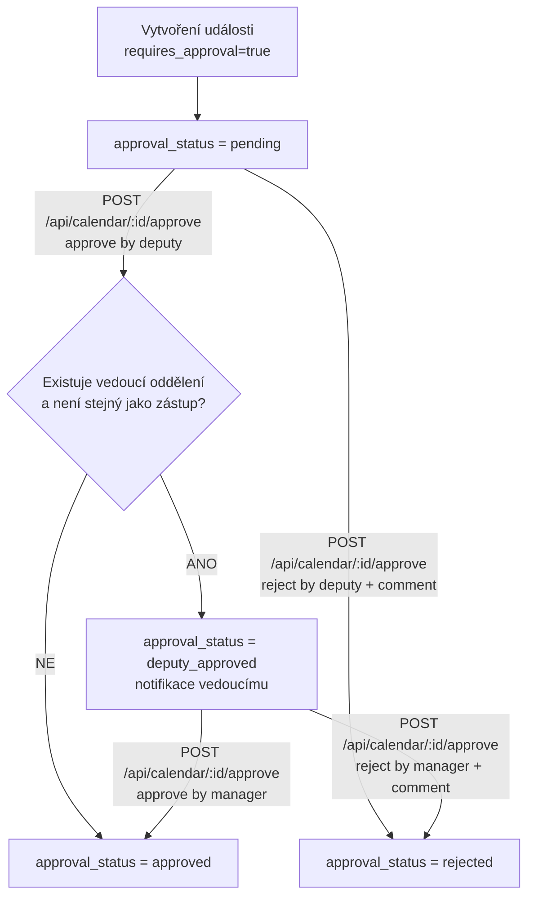

# Modul Kalendář – dokumentace

Modul kalendáře slouží ke správě událostí a termínů v aplikaci INTEGRAF. Nabízí týdenní i měsíční zobrazení, dvoufázové schvalování (zástup → vedoucí oddělení), drag & drop přesun událostí a export do formátu iCalendar (.ics).

## Přehled funkcí

- **Týdenní zobrazení** – mřížka s dny v týdnu (po–ne) a hodinovými sloty (0–23)
- **Měsíční zobrazení** – přehled celého měsíce v mřížce 6 týdnů
- **Seznam osobní / Seznam globální** – řádkové zobrazení událostí na 14 dní dopředu s listováním
- **Řádek „Celý den“** – pro celodenní události (týdenní pohled)
- **Navigace** – předchozí/další týden nebo měsíc, posun o den (týden), návrat na aktuální období
- **Filtry** – Globální kalendář (všechny události) / Osobní kalendář (jen moje)
- **Vyhledávání** – fulltext v názvu, popisu, místě; vyhledávání podle lidí (tvůrce, zástup, účastníci)
- **České státní svátky** – zobrazení v mřížce (týdenní i měsíční pohled)
- **CRUD událostí** – vytvoření, zobrazení detailu, úprava, **mazání**
- **Vytvoření kliknutím** – kliknutí do mřížky otevře modal s předvyplněným datem a časem
- **Drag & drop** – přesun vlastních událostí přetažením; u dovolené/osobní reset schválení
- **Dvoufázové schvalování** – zástup schválí → vedoucí oddělení schválí (definitivní)
- **Kontrola kolizí zástupu** – okamžitá kontrola kolize „mimo firmu“ při výběru zástupu
- **Pozvánky na další účastníky** – výběr více účastníků události a notifikace pozvánkou
- **Notifikace** – na dashboardu i v headeru (zvoneček); události ke schválení na dashboardu
- **Barva podle typu události** – pevné barvy dle `event_type` (uživatel nevybírá); ukládá se do `color` v DB
- **Opakování** (pouze u typů *bez* povinného zástupu) – denní / týdenní / měsíční série do zvoleného data; každý výskyt = samostatný záznam
- **Připomínky** – volitelná doba před začátkem (např. 15 min, 1 den); notifikace v aplikaci a/nebo e-mail; vyžaduje plánované volání cron endpointu
- **Export .ics** – stažení kalendáře pro import do Outlook, Google Calendar atd.

---

## Vzorová data (vývoj / demo)

Skript vytvoří cca 30 událostí na příštích 20 dní pro aktivní uživatele z kontaktů:

```bash
npm run seed:calendar
```

Vyžaduje `DATABASE_URL` v `.env`. Opakované spuštění přidá další záznamy.

---

## Struktura souborů

```
app/(dashboard)/calendar/
├── page.tsx              # Hlavní stránka kalendáře
├── add/page.tsx          # Přidání nové události
├── [id]/page.tsx         # Detail události
├── [id]/edit/page.tsx    # Úprava události
├── CalendarNav.tsx       # Navigace mezi týdny/měsíci (client)
├── CalendarTabs.tsx      # Záložky filtrů Globální/Osobní (client)
├── CalendarViewToggle.tsx # Přepínač Týden/Měsíc/Seznam osobní/Seznam globální (client)
├── CalendarSearch.tsx    # Vyhledávací pole a přepínač Seznam/Kalendář (client)
├── CalendarSearchResults.tsx # Řádkové zobrazení výsledků vyhledávání (client)
├── CalendarListView.tsx  # Řádkové zobrazení událostí 14 dní s listováním (client)
├── WeekCalendarGrid.tsx  # Týdenní mřížka dnů × hodin (client)
├── MonthCalendarGrid.tsx # Měsíční mřížka (client)
├── CreateEventModal.tsx  # Modal pro vytvoření události (client)
├── ApproveRejectButtons.tsx # Tlačítka Schválit/Zamítnout (client)
├── DeleteEventButton.tsx # Tlačítko Smazat s potvrzením (client)
├── ConfirmMoveModal.tsx  # Potvrzení přesunu události (client)
└── lib/
    ├── week-utils.ts          # Pomocné funkce pro práci s týdny
    ├── month-utils.ts         # Pomocné funkce pro měsíční zobrazení
    ├── event-types.ts         # Typy událostí, štítky, zástup; re-export getColorForEventType
    ├── calendar-form-options.ts # Opakování a předvolby připomínek (UI)
    └── holidays.ts            # České státní svátky (pevné + Velikonoce)

lib/ (kořen projektu, sdílené s API)
├── calendar-event-colors.ts   # mapování event_type → barva (#hex)
├── calendar-recurrence.ts     # výpočet termínů opakování (denně/týdně/měsíčně)
└── calendar-create-one.ts       # vytvoření jednoho záznamu (transakce, schvalování)

app/api/calendar/
├── route.ts              # GET (seznam), POST (vytvoření)
├── [id]/route.ts         # GET (detail), PUT (úprava), DELETE (mazání)
├── [id]/approve/route.ts # POST – schválení/zamítnutí (zástup nebo vedoucí)
├── [id]/move/route.ts    # PATCH – přesunutí události
├── deputies/route.ts     # GET – seznam možných zástupců
└── export/route.ts       # GET – export .ics

app/api/cron/calendar-reminders/
└── route.ts              # GET – odeslání dávkových připomínek (CRON_SECRET)
```

---

## Komponenty

### CalendarNav

Navigace v kalendáři (závisí na zobrazení):

**Týdenní pohled:**
- **«** – předchozí týden (−7 dní)
- **<** – o den zpět (−1 den)
- **>** – o den vpřed (+1 den)
- **»** – další týden (+7 dní)
- **Nyní** – návrat na aktuální týden

**Měsíční pohled:**
- **<** – předchozí měsíc
- **>** – další měsíc
- **Nyní** – aktuální měsíc

### CalendarViewToggle

Přepínač zobrazení:
- **Týden** – týdenní mřížka s hodinami
- **Měsíc** – měsíční přehled (6 týdnů)
- **Seznam osobní** – řádkové zobrazení událostí z osobního kalendáře (14 dní dopředu)
- **Seznam globální** – řádkové zobrazení všech událostí (14 dní dopředu)

URL parametr `view` (`week` | `month` | `list_mine` | `list_all`). Pro měsíc též `month` (YYYY-MM). Pro seznamy `list_from` a `list_to` (YYYY-MM-DD).

### CalendarTabs

Přepínání mezi pohledy (zobrazuje se jen u Týden/Měsíc, u seznamů je scope daný pohledem):
- **Globální kalendář** – všechny události
- **Osobní kalendář** – události uživatele, události kde je zástupem, události čekající na schválení vedoucím

URL parametr `scope` (`all` | `mine`).

Poznámka: režim „Kalendář oddělení“ (`scope=department`, `dept_id`) je aktuálně deaktivovaný a v UI se nepoužívá.

### CalendarSearch

Vyhledávací pole:
- **Fulltext** – název, popis, místo
- **Lidé** – tvůrce, zástup, účastníci (podle jména)
- Při vyhledávání: přepínač **Seznam** / **Kalendář** pro zobrazení výsledků

URL parametr `q` (vyhledávací řetězec), `display` (`calendar` = zobrazit v mřížce).

### CalendarSearchResults

Řádkové zobrazení výsledků vyhledávání:
- Tabulka: Datum, Čas, Název, Lidé, Místo
- Odkaz na detail události
- Tlačítko **Zobrazit v kalendáři** – přepne na mřížku s filtrem

### CalendarListView

Řádkové zobrazení událostí (Seznam osobní / Seznam globální):
- Tabulka: Datum, Čas, Název, Lidé, Místo
- **14 dní dopředu** od zvoleného data
- **Listování** – tlačítka „Předchozí 14 dní“ a „Další 14 dní“
- Odkaz na detail události

### České státní svátky (lib/holidays.ts)

- **Pevné svátky:** Nový rok, Svátek práce, Den vítězství, Cyril a Metoděj, Jan Hus, Den české státnosti, 28. říjen, 17. listopad, Štědrý den, 1. a 2. svátek vánoční
- **Pohyblivé:** Velký pátek, Velikonoční pondělí (výpočet dle gregoriánského algoritmu)
- Zobrazení v týdenní i měsíční mřížce (šedé štítky), zvýraznění sloupců dnů se svátky

### WeekCalendarGrid

Týdenní mřížka:
- **Hlavička** – sloupce pro jednotlivé dny (po 16. 3., út 17. 3., …)
- **Řádek „Celý den“** – pro celodenní události
- **Zvýraznění dne** – má-li den běžnou celodenní událost (ne úkol), je **podbarvený celý sloupec** (hlavička toho dne, bunka „Celý den“ i mřížka 0–23) jemným mixem barvy události (`allDayColumnAccent`, `cellAllDayShadeStyle`)
- **Hodinové řádky** – 0–23
- **Události** – barevné bloky (`color` v DB, při vytvoření/úpravě dle typu) s odkazem na detail; vícedenní události ve všech dnech
- **Štítky stavu** – Čeká na schválení (žlutý), Čeká na vedoucího (modrý), Schváleno (červený)
- **Drag & drop** – tvůrce může přetahovat své události na nové datum/čas
- **Kliknutí** – buňka otevře modal pro novou událost, událost vede na detail

### MonthCalendarGrid

Měsíční mřížka:
- **6 týdnů** (pondělí–neděle)
- **Dny mimo měsíc** – šedé pozadí
- **Dnešní den** – červené zvýraznění
- **Události** – max. 3 na den, odkaz na detail; indikátory schválení. Celodenní (`isAllDayEvent`) se přiřazují ke dni přes **`allDayEventDisplayDates`**, ne čistě přes časový průnik (tím se předejde dvojímu zobrazení u `[UTC, UTC+1d)` a podobně)
- **Kliknutí na den** – modal pro novou celodenní událost

### Celodenní události a `isAllDayEvent` (lib/event-types.ts)

Server často vrací začátek/konec jako `Date` z ISO řetězců s UTC půlnocí; v českém prohlížeči může začátek vypadat jako **01:00 nebo 02:00**, přesto jde o celý den. Funkce **`isAllDayEvent(start, end)`** proto kromě „lokální 00:00 a konec téhož dne (23:59+)“ rozpozná i **konec v další půlnoči (UTC)**, tj. interval `[Y-M-D 00:00:00Z, (Y-M-D+1) 00:00:00Z)` o délce celého dne (časté v DB/JSON), dále **UTC 00:00:00** s koncem téhož kalendářního dne v UTC (23:59) a bloky 20–26 h ve stejném UTC dni — aby se záznamy vykreslily v řádku **Celý den** a ne v hodinové mřížce. Pro řádek „Celý den“ určuje, které sloupce se mají obarvit, **`allDayEventDisplayDates`**, aby exkluzivní konec o půlnoči nerozšířil zobrazení do dvou dnů. Když začátek i konec spadají do **jednoho kalendářního dne v UTC** (např. 00:00Z–23:59Z), bere se jeden **lokální** den podle půlne v UTC ve stejném UTC dni — jinak by konec v CEST mohl mít jiné lokální datum než začátek a vznikly by dva sloupce.

V **formulářích** (modal / přidat / upravit) se pro `datetime-local` a výchozí stav **nepoužívá** `toISOString().slice(…)` (to je v UTC a v CEST posune o den). Použijí se **`formatDateTimeLocalForInput`**, **`formatDateLocal`**; u celodenního uložení se do API posílají **`allDayYmdRangeToIsoStrings`**, tj. skutečná lokální 00:00 až 23:59:59.999 přes `toISOString()`.

---

## API endpointy

| Metoda | Endpoint | Popis |
|--------|----------|-------|
| GET | `/api/calendar` | Seznam událostí. Parametry: `from`, `to` (YYYY-MM-DD) |
| POST | `/api/calendar` | Vytvoření události |
| GET | `/api/calendar/[id]` | Detail události |
| PUT | `/api/calendar/[id]` | Úprava události |
| DELETE | `/api/calendar/[id]` | Smazání události (jen tvůrce). Notifikace schvalovatelům. |
| POST | `/api/calendar/[id]/approve` | Schválení/zamítnutí. Body: `{ action: "approve"|"reject", comment?: string }` |
| PATCH | `/api/calendar/[id]/move` | Přesunutí události. Body: `{ start_date, end_date, all_day? }` |
| GET | `/api/calendar/export` | Export .ics. Parametr: `scope=all` | `mine` (admin může `all`) |
| GET | `/api/calendar/deputies` | Seznam možných zástupců (z hlavního + sekundárních oddělení) |
| GET | `/api/calendar/deputies/check` | Rychlá kontrola kolize zvoleného zástupu (`deputy_id`, termín, volitelně `exclude_event_id`) |
| GET | `/api/calendar/invitees` | Seznam uživatelů pro pozvánky (další účastníci) |
| GET | `/api/cron/calendar-reminders` | Připomínky: `?secret=` = `CRON_SECRET` nebo `Authorization: Bearer` |

### Vytvoření události (POST /api/calendar, body)

Barvu server **nepřijímá** – vždy nastaví `getColorForEventType(event_type)`.

- **Opakování:** `recurrence` = `none` | `daily` | `weekly` | `monthly`. Pokud není `none`, vyplnit **`recurrence_end`** (datum YYYY-MM-DD, poslední den řady včetně). U typů **Dovolená** a **Osobní** není opakování povoleno (API vrátí 400).
- **Připomínka:** `remind_before_minutes` = `null` nebo jedna z hodnot: `15`, `30`, `60`, `120`, `1440`. Volitelné `reminder_notify_in_app`, `reminder_notify_email` (výchozí true; pokud je připomínka zvolena, alespoň jeden kanál musí být zapnutý).
- **Pozvánky:** `participant_user_ids` = pole ID uživatelů (bez autora a bez zástupu; API duplicitní / neplatné hodnoty odfiltruje).
- **Služební cesta:** u `event_type = "sluzebni_cesta"` je povinný `description` (kam a proč jedete), aby schvalovatel viděl kontext.

```json
{
  "title": "Název události",
  "description": "Popis",
  "start_date": "2026-03-16T09:00:00",
  "end_date": "2026-03-16T10:00:00",
  "event_type": "dovolena|osobni|schuzka_mimo_firmu|schuzka_nachod|schuzka_praha|sluzebni_cesta|lekar|nemoc|vzdelavani|jine",
  "department_id": 1,
  "deputy_id": 5,
  "is_public": false,
  "location": "Místo",
  "recurrence": "none",
  "recurrence_end": "2026-12-31",
  "remind_before_minutes": 15,
  "reminder_notify_in_app": true,
  "reminder_notify_email": true
}
```

Odpověď může obsahovat `ids` a `count` (počet vytvořených záznamů při opakování).

### Úprava události (PUT /api/calendar/[id], body)

Stejná pole jako u vytvoření kromě opakování (úprava jedné instance; barva se znovu odvodí z `event_type`). Připomínky: při změně začátku/konce nebo doby připomínky se `reminder_notified_at` vymaže, aby se připomínka znovu mohla odeslat.

---

## Databázové modely (Prisma)

### calendar_events

| Pole | Typ | Popis |
|------|-----|-------|
| id | Int | PK |
| title | String | Název |
| description | String? | Popis |
| start_date | DateTime | Začátek |
| end_date | DateTime | Konec |
| event_type | String? | dovolena, osobni, schuzka_mimo_firmu, schuzka_nachod, schuzka_praha, sluzebni_cesta, lekar, nemoc, vzdelavani, jine |
| created_by | Int | FK users |
| department_id | Int? | FK departments |
| deputy_id | Int? | FK users (zástup; povinné u Dovolená, Osobní) |
| is_public | Boolean? | Veřejná událost |
| color | String? | Barva v mřížce (#hex) – u nových/uložených událostí odpovídá typu (`lib/calendar-event-colors.ts`) |
| location | String? | Místo |
| remind_before_minutes | Int? | Minuty před začátkem, nebo null = bez připomínky |
| reminder_notify_in_app | Boolean? | Upozornění v aplikaci (notifikace) |
| reminder_notify_email | Boolean? | Upozornění e-mailem |
| reminder_notified_at | DateTime? | Kdy byla připomínka naposledy odeslána (idempotence) |
| requires_approval | Boolean? | true, pokud je deputy_id |
| approval_status | String? | pending, deputy_approved, approved, rejected |

### Dvoufázové schvalování (deputy_id)

U typů **Dovolená** a **Osobní** je pole **Zástup** povinné. Workflow:

1. **pending** – zástup dostane notifikaci, schválí nebo zamítne

#### Schéma schvalovacího workflow kalendáře (aktuální implementace)



Pravidla:

- `pending` schvaluje pouze uživatel v `deputy_id`.
- `deputy_approved` schvaluje pouze vedoucí oddělení žadatele (`departments.manager_id` přes `event.department_id` nebo `creator.department_id`).
- `reject` vyžaduje povinný `comment`.
- Pokud vedoucí oddělení není určen, nebo je stejný jako zástup, schválení zástupem přechází rovnou do `approved`.
2. **deputy_approved** – zástup schválil; vedoucí oddělení žadatele dostane notifikaci
3. **approved** – vedoucí schválil (definitivní); nebo zástup schválil a oddělení nemá vedoucího
4. **rejected** – zamítnuto zástupem nebo vedoucím

- API: `GET /api/calendar/deputies` – seznam možných zástupců
- API: `POST /api/calendar/[id]/approve` – schválení/zamítnutí (zástup nebo vedoucí)
- **Dashboard** – sekce „Události ke schválení“ a „Notifikace“ (nepřečtené)

### Typy událostí (event_type)

| Hodnota v DB | Zobrazení |
|--------------|-----------|
| dovolena | Dovolená |
| osobni | Osobní |
| schuzka_mimo_firmu | Schůzka mimo firmu |
| schuzka_nachod | Schůzka Náchod |
| schuzka_praha | Schůzka Praha |
| sluzebni_cesta | Služební cesta |
| lekar | Lékař |
| nemoc | Nemoc |
| vzdelavani | Vzdělávání |
| jine | Jiné |

Definice v `app/(dashboard)/calendar/lib/event-types.ts`, mapování barev v `lib/calendar-event-colors.ts`, výchozí typ: `jine`.

### calendar_approvals | calendar_event_participants

- **calendar_approvals** – workflow schvalování (zástup, vedoucí)
- **calendar_event_participants** – účastníci události; využíváno při vyhledávání podle lidí, v řádkovém zobrazení (Seznam, výsledky vyhledávání) a pro notifikace pozvánek

### Barva podle typu události

- Uživatel **nevybírá** barvu; při `POST` a `PUT` server nastaví `color` z `getColorForEventType(event_type)`.
- Definice odstínů: `lib/calendar-event-colors.ts` (dovolená, schůzky, lékař, jiné, …).

### Opakování

- Dostupné v **modalu** a na **`/calendar/add`**: Neopakovat / **Každý den** / **Každý týden** / **Každý měsíc** + **Opakovat do** (konec řady, včetně toho dne; výchozí obvykle +3 měsíce od začátku).
- U **Dovolená** a **Osobní** je opakování v UI vypnuté; API to stejně odmítne.
- Logika generování termínů: `lib/calendar-recurrence.ts` (horní strop počtu výskytů, např. 200).
- Každá instance je **samostatný řádek** v `calendar_events` (žádné `series_id` v DB v1).

### Připomínky a plánovaný job

- Formulář: výběr doby před začátkem (nebo žádná) + zaškrtnutí **Notifikace v aplikaci** a/nebo **E-mail**.
- Po naplánovaném čase vytvoří notifikaci typu `calendar_reminder` a volitelně odešle e-mail (`sendCalendarReminderEmail` v `lib/email.ts`); u záznamu se nastaví `reminder_notified_at`, aby se neposílalo opakovaně.
- Produkce musí **pravidelně** volat např. `GET /api/cron/calendar-reminders?secret=<CRON_SECRET>` (tajemství v `.env` jako `CRON_SECRET`; alternativně hlavička `Authorization: Bearer <CRON_SECRET>`), doporučený interval **1–5 minut** (externí cron, plánovač OS, apod. bez běžícího `sleep` uvnitř Next).

### Migrace DB (připomínky)

- SQL soubor: `prisma/migrations/20260422_calendar_reminders.sql` (přidání sloupců do `calendar_events`). Nasazení např. `./scripts/deploy-server.sh --apply-sql 20260422_calendar_reminders.sql` po konzultaci s provozem.

---

## Oprávnění

- Modul `calendar` je v `lib/auth-utils.ts` a `getLayoutAccess()`
- Přístup se kontroluje přes role (`module_access` JSON)
- Export vyžaduje `hasModuleAccess(userId, "calendar", "read")`
- API vyžaduje přihlášeného uživatele (session)

---

## Implementace (březen 2026)

### Provedené změny

1. **Týdenní zobrazení** – mřížka dnů × hodin, řádek „Celý den“, týden = po–ne

2. **Dvoufázové schvalování** – zástup → vedoucí oddělení; stavy `pending`, `deputy_approved`, `approved`, `rejected`

3. **Tlačítka Schválit/Zamítnout** – na detailu události pro zástupce a vedoucího; modal pro důvod zamítnutí

4. **Mazání událostí** – tlačítko Smazat (jen tvůrce), notifikace schvalovatelům při smazání schválené události

5. **Drag & drop** – přesun vlastních událostí v týdenním pohledu; reset schválení u dovolené/osobní

6. **Měsíční zobrazení** – přepínač Týden/Měsíc, MonthCalendarGrid, `lib/month-utils.ts`

7. **Dashboard** – sekce Události ke schválení, Notifikace (nepřečtené)

8. **Přidání lib/week-utils.ts, lib/month-utils.ts**
   - `getWeekStart()`, `getWeekEnd()`, `getPrevWeek()`, `getNextWeek()`, `getCurrentWeek()`
   - `getMonthGridStart()`, `getMonthGridEnd()`, `getPrevMonth()`, `getNextMonth()`, `formatMonth()`
   - `formatDateLocal()`, `parseDateLocal()` – formátování dat v lokální časové zóně

9. **České státní svátky** – `lib/holidays.ts`, zobrazení v mřížce (týdenní i měsíční)

10. **Vyhledávání** – fulltext (název, popis, místo) a podle lidí (tvůrce, zástup, účastníci); řádkové zobrazení výsledků s přepínačem na kalendář

11. **Seznam osobní / Seznam globální** – řádkové zobrazení událostí na 14 dní dopředu s listováním (Předchozí/Další 14 dní)

12. **(duben 2026) Barva podle typu** – odstranění výběru barvy v UI, `lib/calendar-event-colors.ts`

13. **(duben 2026) Opakování** – denní/týdenní/měsíční série, `lib/calendar-recurrence.ts`, rozšíření `POST /api/calendar`

14. **(duben 2026) Připomínky** – sloupce v `calendar_events`, endpoint `/api/cron/calendar-reminders`, e-mail `sendCalendarReminderEmail`

15. **(duben 2026) Pozvánky účastníků** – endpoint `/api/calendar/invitees`, komponenta `CalendarInviteeSelect`, ukládání přes `calendar_event_participants`, notifikace pozvaným.

16. **(duben 2026) Kontrola kolize zástupu** – endpoint `/api/calendar/deputies/check`; varování v UI při výběru zástupu, blokace kolidujících termínů.

17. **(duben 2026) Služební cesta – povinný popis** – pro `sluzebni_cesta` je vyžadovaný popis „kam a proč“, viditelný pro schvalovatele.

18. **(duben 2026) Osobní kalendář vedoucího** – vedoucí v osobním pohledu vidí i události čekající na jeho schválení (`deputy_approved`).

### URL parametry stránky

- `view` – `week` (výchozí) | `month` | `list_mine` | `list_all`
- `from` – začátek období (YYYY-MM-DD), pro týdenní pohled
- `to` – konec období (YYYY-MM-DD), pro týdenní pohled
- `month` – pro měsíční pohled (YYYY-MM)
- `list_from` – začátek období pro seznam (YYYY-MM-DD)
- `list_to` – konec období pro seznam (YYYY-MM-DD), vždy 14 dní od list_from
- `scope` – `all` (výchozí) | `mine`
- `q` – vyhledávací řetězec (fulltext + lidé)
- `display` – `calendar` = při vyhledávání zobrazit mřížku místo seznamu výsledků

Příklady:
- `/calendar?view=week&from=2026-03-16&to=2026-03-22&scope=mine`
- `/calendar?view=month&month=2026-03&scope=all`
- `/calendar?view=list_mine&list_from=2026-03-16&list_to=2026-03-29`
- `/calendar?q=Jan&display=calendar`

---

## Mazání událostí

- Tlačítko **Smazat** na detailu události (jen pro tvůrce)
- Potvrzovací modal
- Při smazání schválené události: notifikace všem schvalovatelům (z `calendar_approvals` se statusem approved)

---

## Přesun událostí (drag & drop)

- **Týdenní pohled** – tvůrce může přetahovat své události
- **Řádek „Celý den“** – přetažení na den (zachová délku u vícedenních)
- **Časová mřížka** – přetažení na buňku (zachová délku)
- **Potvrzení** – modal s novým datem/časem
- **Dovolená/Osobní** – po přesunu reset schválení na `pending`, notifikace zástupovi

---

## Dashboard

- **Události ke schválení** – události čekající na schválení (jako zástup nebo vedoucí)
- **Notifikace** – nepřečtené notifikace (aktivní, čekající na vyřízení)
