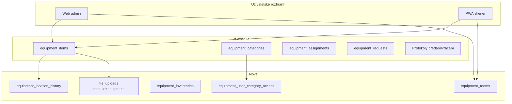

# Majetek – evidence drobného majetku s QR kódy

Technický plán rozšíření modulu **Majetek** (`equipment`, URL `/equipment`) o komplexní správu drobného majetku s QR identifikací, místnostmi, inventurou a rolemi.

Související dokumentace:

- [MODUL_MAJETEK_POZADAVKY.md](MODUL_MAJETEK_POZADAVKY.md) – schvalování požadavků na techniku (IT → Vedení), **již implementováno**

---

## Shrnutí v bodech

### Co už v aplikaci je

- Evidence položek majetku (`equipment_items`) – název, značka, model, S/N, cena, dodavatel, faktura, stav, poznámky
- Skupiny majetku v databázi (`equipment_categories`) – bez admin UI
- Přiřazení majetku zaměstnancům + **předávací / vrácení protokoly** (`/equipment/protokol/predani`, `vraceni`)
- Požadavky na novou techniku (veřejný formulář + workflow IT/Vedení)
- Seznam majetku s řazením a základními filtry

### Co plán přidává

- **Skupiny majetku** – plná administrace (IT technika, bílá technika, nářadí…), zodpovědný uživatel za skupinu
- **Místnosti** – samostatná evidence s QR štítky (odděleně od kalendáře rezervací)
- **QR / inventární kódy** – `asset_tag`, `qr_code`, tisk štítků **vizitka (90×50 mm)**
- **Předgenerované QR** – generace X kódů naprázdno, tisk, pozdější sken a přiřazení majetku
- **PWA skener** – naskenovat místnost + zařízení → umístění v databázi
- **Přesun mezi místnostmi** – sken, ručně, hromadně; protokol HTML/PDF; append-only historie
- **Role** – správce majetku, zodpovědný za skupinu, nahlížení dle skupin
- **Kompletní detail** – všechna pole včetně ceny, záruky, vyřazení, místnosti
- **Fotogalerie** – upload JPG/PNG/WebP, focení z mobilu (`capture`), náhledová fotka
- **Přílohy** – PDF faktury, záruční listy
- **Inventura** – inventurní akce se skenováním, stavy nalezeno/chybí/neočekávané
- **Reporty** – přehledy, souhrn hodnot, historie přesunů, export CSV/PDF/Excel
- **Dashboard** – KPI, upozornění (končící záruka, chybějící místnost/fotka)
- **Vyřazení** – formální workflow s protokolem
- **Import/export Excel** – hromadné zavedení evidence

### Co je mimo scope (Fáze 5 / budoucí)

- Účetní amortizace a odpisy
- Externí výpůjčky mimo organizaci
- Offline inventura bez připojení k síti
- Nativní Android aplikace (API připravíme, PWA pokryje první fázi)

### Odhad implementace

| Fáze | Rozsah | Odhad |
|------|--------|-------|
| 1 | Model, role, admin, detail, fotky, štítky, fond QR | 5–7 dní |
| 2 | PWA skener, přesuny, protokoly, vyřazení | 3–4 dny |
| 3 | Inventura, reporty, dashboard, Excel | 3–4 dny |
| 4 | Nativní Android | samostatný projekt |
| 5 | Volitelná rozšíření | dle potřeby |

**Celkem MVP (Fáze 1–3):** přibližně 11–14 pracovních dní.

---

## Architektura

Modul rozšiřujeme pod existujícím klíčem `equipment` (URL `/equipment`, oprávnění v `module_access`). Nezakládáme paralelní `/majetek`.

---

## Role a oprávnění

| Role | Přidělení | Oprávnění |
|------|-----------|-----------|
| **Správce majetku** | `equipment:admin` v Admin → Uživatelé | Skupiny, místnosti, přístupy nahlížení, hromadný tisk štítků místností |
| **Editor modulu** | `equipment:write` | Zápis všech položek (zachovat pro IT workflow) |
| **Čtenář modulu** | `equipment:read` | Čtení všeho, nebo jen přidělených skupin (pokud má záznamy v `equipment_user_category_access`) |
| **Zodpovědný za skupinu** | `responsible_user_id` na `equipment_categories` | CRUD položek ve skupině, skenování, přesuny, inventura skupiny |
| **Nahlížení** | `equipment_user_category_access` | Jen čtení přidělených skupin |

Centrální logika: `lib/equipment/access.ts` – všechny API routes kontrolují přístup přes `canReadEquipment` / `canWriteEquipment` s kontextem `categoryId`.

---

## Datový model

### Nové tabulky

**`equipment_rooms`**

| Pole | Popis |
|------|-------|
| `name`, `code` | Název a kód místnosti (např. A-205) |
| `building`, `floor`, `description` | Upřesnění polohy |
| `qr_code` | Unikátní kód pro štítek (`RM-…`) |
| `is_active` | Aktivní / archivovaná |

**`equipment_location_history`** (append-only audit přesunů)

| Pole | Popis |
|------|-------|
| `equipment_id`, `from_room_id`, `to_room_id` | Přesun |
| `transferred_by`, `transferred_at` | Kdo a kdy |
| `source` | `scan` / `manual` / `bulk` |
| `notes`, `protocol_number` | Poznámka, číslo protokolu (`PM-{rok}-{id}`) |

**`equipment_user_category_access`**

| Pole | Popis |
|------|-------|
| `user_id`, `category_id` | Přístup uživatele ke skupině |
| `access_level` | `read` (nahlížení) |
| `granted_by`, `granted_at` | Audit přidělení |

**`equipment_inventories`** + **`equipment_inventory_lines`**

- Inventurní akce: název, rozsah (vše / místnost / skupina), stav (koncept / probíhá / dokončeno)
- Řádky: položka, očekávaná místnost, čas skenu, stav (`found` / `missing` / `unexpected` / `extra`)

**`equipment_qr_pool`** — fond předgenerovaných kódů

| Pole | Popis |
|------|-------|
| `qr_code`, `asset_tag` | Unikátní kód a inventární číslo |
| `status` | `available` / `assigned` / `void` |
| `batch_id` | Dávka generování |
| `equipment_id` | Položka po přiřazení (null = volný) |

### Rozšíření `equipment_items`

| Pole | Popis |
|------|-------|
| `asset_tag` | Inventární číslo (např. EQ-00001234) |
| `qr_code` | Payload pro QR kód |
| `room_id` | FK na místnost |
| `cover_file_id` | Náhledová fotka |
| `warranty_until` | Konec záruky |
| `last_service_at` | Poslední servis |

Pole `location` (volný text) zůstává – synchronizuje se z místnosti při přesunu.

### Soubory (`file_uploads`)

| `document_type` | Účel |
|-----------------|------|
| `photo` | Fotografie majetku |
| `photo_cover` | Náhledová fotka |
| `invoice` | Faktura (FA) |
| `delivery_note` | Dodací list |
| `warranty` | Záruční list |
| `service` | Servisní protokol |
| `attachment` | Obecná příloha |
| `other` | Jiný dokument |

UI: sekce **Dokumenty** na detailu položky (`EquipmentDocumentsPanel`). API: `GET/POST/DELETE /api/equipment/[id]/photos?kind=attachment`.

Úložiště: `uploads/equipment/{equipmentId}/`

### Rozšíření `equipment_categories`

- `responsible_user_id` – zodpovědný uživatel za skupinu

---

## Funkce podle oblastí

### 1. Administrace

| Funkce | URL / API | Kdo |
|--------|-----------|-----|
| Skupiny majetku | `/equipment/settings/categories` | Správce |
| Přístupy nahlížení | `/equipment/settings/access` | Správce |
| Místnosti | `/equipment/rooms` | Správce |
| Tisk štítků místností | `GET …/rooms/[id]/label` | Správce |

Výchozí seed skupin: *Výpočetní a komunikační technika*, *Bílá technika*, *Nářadí*.

### 2. Evidence položek

**Pole v detailu a editaci:**

- Identifikace: název, skupina, asset tag, QR, S/N
- Technické: značka, model, popis
- Nákup: datum, cena, dodavatel, číslo faktury
- Stav: skladem / přiřazeno / servis / vyřazeno
- Vyřazení: datum, důvod
- Umístění: místnost (dropdown), historie přesunů
- Záruka a servis: `warranty_until`, `last_service_at`
- Poznámky, datum zápisu, stáří
- Přiřazený uživatel, zodpovědný za skupinu

Sdílená komponenta: `EquipmentItemForm`.

### 3. QR kódy a štítky

**Formát štítku:** jedna vizitka **90 × 50 mm** (majetek i místnost). Ne celý A4 jako jeden štítek.

| Typ | Obsah na štítku |
|-----|-----------------|
| Majetek | Název, asset tag, skupina, QR |
| Místnost | Název, kód, budova/patro, QR |
| **Předgenerovaný (fond)** | QR + asset tag (+ „INTEGRAF“) — **bez názvu** majetku |

- Formát QR payloadu: `INTEGRAF:EQ:{qr_code}` / `INTEGRAF:RM:{qr_code}`
- API obrázku: `GET /api/equipment/qr?code=…`
- **Jednotlivý tisk:** PDF = 1 stránka = 1 vizitka
- **Hromadný tisk:** více vizitek na A4 (mřížka, např. 2×5 na stránku)
- Kartička majetku PDF (A4) — samostatný dokument se všemi údaji, **není** náhradou za vizitkový štítek

#### Předgenerované QR (tisk naprázdno → přiřazení)

Praktický workflow: správce vygeneruje X kódů, vytiskne vizitky, nalepí je na zařízení, a teprve při evidenci naskenuje štítek a přiřadí ho položce.

| Krok | Co se děje |
|------|------------|
| 1. Generace | `/equipment/settings/qr-pool` — zadat počet X (1–500) → dávka v `equipment_qr_pool` (`status: available`) |
| 2. Tisk | PDF dávky — mřížka vizitek 90×50 mm (jen QR + inventární číslo) |
| 3. Nalepení | Fyzicky na zařízení |
| 4. Přiřazení | Sken volného QR → nová položka / existující bez QR / PWA režim *Přiřadit QR* |

Stavy kódu: `available` (volný) → `assigned` (přiřazený) / `void` (ztracený nebo poškozený štítek).

API: `POST …/qr-pool/generate`, `GET …/batches/[id]/pdf`, `POST …/qr-pool/assign`, `POST …/qr-pool/[id]/void`.

Alternativa: při vytvoření položky bez skenu se `qr_code` + `asset_tag` vygenerují automaticky (jako dosud v plánu).

### 4. PWA skener (Android / mobil)

Stránka `/equipment/scan`:

1. Naskenuj QR místnosti
2. Naskenuj QR zařízení (opakovaně)
3. Potvrzení → `POST /api/equipment/placement`
4. Volitelně tisk protokolu přesunu

Závislost: `html5-qrcode`. Fallback: ruční zadání kódu.

**Ruční zadání:** na skenování, přesunu i inventuře lze vždy zadat **inventární číslo** položky (`EQ-…` / `asset_tag`) nebo **kód místnosti** (např. `V-ADM`) — stejné hodnoty, které jsou vytištěné na vizitkových štítcích vedle QR. Lookup API (`parseEquipmentScanCode` / `/api/equipment/lookup`) akceptuje `asset_tag`, `qr_code` i `code` místnosti.

### 5. Přesun mezi místnostmi

Jednotná funkce `transferEquipmentToRoom()` v `lib/equipment/room-transfer.ts`:

| Způsob | `source` |
|--------|----------|
| Sken PWA | `scan` |
| Formulář / modal | `manual` |
| Výběr více položek | `bulk` |

**Protokol přesunu:**

- HTML: `/equipment/protokol/presun-mistnosti?historyId=`
- PDF: `GET /api/equipment/transfers/[historyId]/pdf`

**Audit:** `equipment_location_history` + `audit_log` (`action: room_transfer`).

### 6. Fotogalerie a přílohy

**Fotky:**

- Upload více souborů (JPG, PNG, WebP, GIF)
- Focení z mobilu: `<input capture="environment">`
- Náhledová fotka ve seznamu majetku
- API: `/api/equipment/[id]/photos`

**Přílohy:**

- PDF faktury, záruční listy, servisní protokoly
- API: `/api/equipment/[id]/attachments`

### 7. Přiřazení zaměstnanci (existující)

- Přiřazení / vrácení majetku uživateli
- Protokoly předání a vrácení
- Nezávislé na umístění v místnosti

### 8. Inventura a inventurní sestavy

**Tři rozsahy** (platí pro živou inventuru i statické sestavy):

| Rozsah | Popis |
|--------|-------|
| **Kompletní** | Celý majetek (dle oprávnění uživatele) |
| **Skupina** | Jedna skupina majetku (IT technika, nářadí…) |
| **Místnost** | Vše v dané místnosti |

**Živá inventura** (`/equipment/inventura`):

- Založení akce s výběrem rozsahu
- Skenování QR v místnosti / seznamu
- Stavy: nalezeno, chybí, neočekávané (špatná místnost), navíc (není v rozsahu)
- Po uzavření → inventurní protokol

**Statická inventurní sestava** (`/equipment/reporty`):

- Okamžitý výpis bez skenování — „stav k dnešku“
- Stejné rozsahy: kompletní / skupina / místnost
- Sloupce: asset tag, název, skupina, místnost, stav, hodnota, přiřazeno komu
- Souhrn: počet položek, `SUM(purchase_price)`
- Export PDF / CSV / Excel

### 9. Reporty a dashboard

**Dashboard** (`/equipment` nebo `/equipment/dashboard`):

- Počty dle skupiny a stavu
- Souhrnná hodnota majetku
- Upozornění: končící záruka, chybějící místnost/fotka
- Poslední přesuny

**Reporty** (`/equipment/reporty`):

- Přehled majetku s filtry
- Souhrn hodnot po skupinách a místnostech
- Historie přesunů
- Export CSV / PDF / Excel

**Vyhledávání:** fulltext v názvu, asset tag, S/N, značce, modelu, poznámkách.

### 10. Vyřazení majetku

- Akce *Vyřadit* na detailu (důvod povinný)
- Protokol o vyřazení HTML/PDF
- Vyřazenou položku nelze přesouvat ani přiřazovat

### 11. Import / export Excel

- Export všech sloupců dle oprávnění
- Import s preview a validací (match dle `asset_tag` nebo S/N)
- Šablona XLSX ke stažení

---

## Implementační fáze

### Fáze 1 – Základy (5–7 dní)

- Prisma migrace (všechny nové tabulky a sloupce včetně `equipment_qr_pool`)
- `lib/equipment/access.ts`
- Admin: skupiny, místnosti, přístupy nahlížení
- QR generování + PDF štítky (vizitka)
- **Fond předgenerovaných QR** — generace X, tisk dávky, přiřazení skenem
- Kompletní detail/editace + fotogalerie
- Přílohy (dokumenty)

### Fáze 2 – Mobil a přesuny (3–4 dny)

- PWA skener `/equipment/scan`
- Lookup API
- Přesun (sken + ruční + hromadný)
- Protokoly přesunu HTML/PDF
- Vyřazení s protokolem
- Úprava seznamu (místnost, miniatura, filtry)

### Fáze 3 – Inventura a reporty (3–4 dny)

- Inventurní akce a řádky
- Dashboard a upozornění
- Reporty a exporty
- Import/export Excel
- Stránkování a fulltext

### Fáze 4 – Nativní Android (budoucí)

- Stabilní REST API pro mobilní klienta
- Sdílený formát QR
- Volitelně token auth mimo session cookies

---

## Kontrolní seznam pokrytí (drobný majetek)

| Požadavek | Stav |
|-----------|------|
| Inventární číslo / QR | Plánováno |
| Předgenerované QR (tisk → sken → přiřazení) | Plánováno |
| Skupiny definované administrátorem | Plánováno |
| Místnosti s QR štítky | Plánováno |
| Skenování mobilem | Plánováno (PWA) |
| Umístění a přesun mezi místnostmi | Plánováno |
| Protokoly přesunu | Plánováno |
| Auditní stopa | Plánováno |
| Role správce / zodpovědný / nahlížení | Plánováno |
| Kompletní karta majetku | Plánováno |
| Fotodokumentace | Hotovo |
| Přílohy (faktury, dodací listy) | Hotovo |
| Pořizovací hodnota a reporty | Plánováno |
| Inventura | Plánováno |
| Vyřazení s protokolem | Plánováno |
| Záruka / servis | Plánováno |
| Přiřazení zaměstnanci + protokoly | **Existuje** |
| Požadavky na techniku | **Existuje** |
| Hromadný import | Plánováno |
| Amortizace | Mimo scope |
| Offline režim | Fáze 5 |

---

## Klíčové soubory

| Oblast | Cesty |
|--------|-------|
| Schéma | `prisma/schema.prisma` |
| Přístupová práva | `lib/equipment/access.ts` |
| Přesuny | `lib/equipment/room-transfer.ts` |
| QR / štítky | `lib/equipment/qr.ts`, `lib/equipment/label-layout.ts`, `lib/equipment/label-pdf.ts` |
| Fond QR | `lib/equipment/qr-pool.ts`, `app/api/equipment/qr-pool/**`, `equipment/settings/qr-pool/**` |
| Upload | `lib/equipment/upload.ts` |
| API | `app/api/equipment/**` |
| UI | `app/(dashboard)/equipment/**` |
| Navigace | `components/layout/Sidebar.tsx` |
| Záloha | `lib/backup/module-registry.ts` (+ `file_uploads`, `uploads/equipment/`) |
| Existující protokoly | `app/(dashboard)/equipment/protokol/` |

---

## Rizika

| Riziko | Mitigace |
|--------|----------|
| Legacy pole `location` (volný text) | Sync z místnosti; postupná konverze |
| Duplicitní QR kódy | Unikátní indexy, generace na serveru |
| Kamera na Androidu vyžaduje HTTPS | Test na Chrome Android; fallback ruční kód |
| Velké množství položek | Stránkování, fulltext, indexy |
| Úložiště fotek | Záloha včetně `uploads/equipment/` |
| Křížení rolí (zodpovědný + nahlížení) | Sjednocení v `access.ts` |
| Zpětná kompatibilita oprávnění | `equipment:read` bez omezení skupin = plný přístup |

---

## Navigace v modulu

V levém sidebaru je jen položka **Majetek** → `/equipment` (bez rozbalovací podnabídky).

Uvnitř modulu je horní lišta záložek (`EquipmentModuleNav`): Přehled, Přiřazení, Místnosti, **Půdorys**, Skenovat, Přesun, Inventura, Reporty, a pro správce **Nastavení** (`/equipment/settings` – hub se skupinami, přístupy a fondem QR).

Na přehledu jsou navíc rychlé dlaždice na hlavní workflow.

### Interaktivní půdorys (`/equipment/plan`)

- Upload PDF/PNG/JPG jako pozadí (1NP, 2NP…) → `equipment_floor_plans`
- Editor polygonů místností (body 0–1 relativně k obrázku) napojený na `equipment_rooms`
- Prohlížení: klik na místnost → seznam majetku; přetažení položky na jinou místnost = přesun (`transferEquipmentToRoom`)
- Zoom / pan (kolečko, režim ruky, mezerník)
